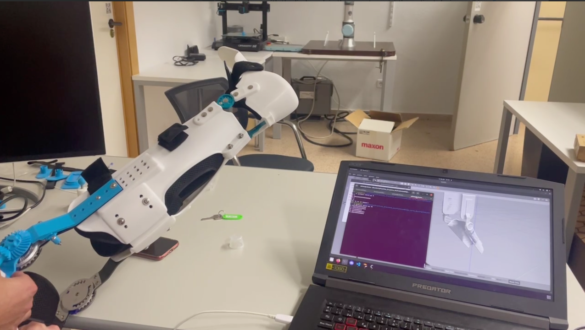

## ARES Exoskelegon

ARES is a project that proposes the development and distribution of a lower limb robotic exoskeleton. The ARES exoskeleton was born with the purpose of giving users with various disabilities the opportunity to regain their mobility, improve their quality of life and increase their autonomy. Specifically, the exoskeleton has been designed to be able to fit a patient's leg in order to allow and facilitate movement.

### Fist ARES Exoskeleton prototype

The first prototype includes the 

### Support or Contact

Check out our [documentation](https://docs.github.com/categories/github-pages-basics/) or [contact support](https://support.github.com/contact) and we’ll help you sort it out.
